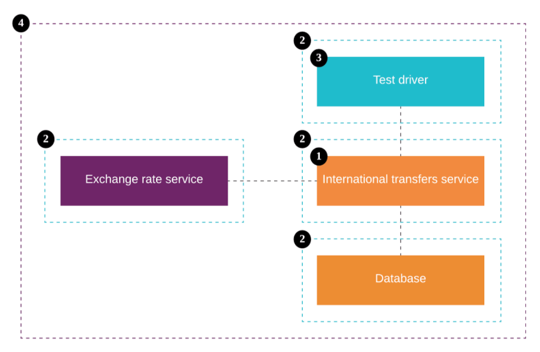

# 构建和测试环境即代码

`构建和测试环境即代码`和`基础设施即代码`，`流水线即代码`的概念相似，就是将你的代码构建和测试环境使用代码来表达，以达到**代码在本机正常工作...同时在任何地方都可以正常工作**。

## 薛定谔的测试

回想这样一个场景，当你加入一个想公司或者加入一个新项目的时候，是不是需要安装很多软件以使得新项目的服务或者测试可以在你本机运行？

假设这个新项目使用的编程语言是NodeJs，使用Mysql存储数据，那么很可能会出现如下情况，每个开发人员本机安装的软件版本都不太相同：

- 开发小A本机环境：NodeJS 8.1, MySQL 5.4
- 开发小B本机环境：NodeJS 8.1, MySQL 5.4
- 开发小C本机环境：NodeJS 9.2, MySQL 5.2
- 开发小D本机环境：NodeJS 12.4, MySQL 5.1

这就是为什么有时候你编写好的代码或者测试在你本机运行成功，但到了别人的机器上就会出问题，原因很可能是你的代码依赖了你本地开发环境的软件版本。即便你依赖的软件版本相同，依然可能会出现错误，因为你本地代码编译环境很可能会依赖于你的操作系统的某些软件。

这个问题甚至曾经在Google也非常严重。在2016的时候，Google就发现84%新的失败测试都是由于`flakiness`。什么是flakiness呢？

> 一个flaky测试就是在相同的配置的情况下这个测试可能会成功也可能会失败.

这个测试是不是很像薛定谔的猫，不运行的时候测试状态处于叠加状态，既可以是成功也可以是失败，当你运行之后才知道是成功还是失败。自动化测试重要性不必多说，但flaky测试显然令开发人员很疑惑，或者说是沮丧。产生flaky测试的原因有很多，而**不一致的测试环境**常常会导致测试的`flakiness`。

## 如何解决测试环境不一致的问题？

### 自动化一切事情

将所有手动的步骤使用脚本将其过程自动化起来使得构建和测试的步骤都是一致的。但光使用自动化脚本是不够的，它的问题在于：

- 所依赖的运行环境的操作系统不一致可能会导致一些问题。
- 端口冲突问题。
- ...

### 虚拟机

使用虚拟机（如Vagrant）可以解决只使用自动脚本所存在的问题。但是使用虚拟机是非常消耗资源的，对于运行在虚拟机里的任务的性能影响是比较大的。所以通常虚拟机并不被推荐在持续集成服务器上使用。

### 共享的测试和集成环境

我经历过一些项目，项目中只有单元测试是可以在本地运行的，而其他的测试都需要将代码部署到云环境后才会运行。这种方式有几个特别大的缺点：

- 从代码更改到在测试环境中运行的周期时间太长。
- 由于测试和集成环境是共享的，所以你对测试环境会影响会影响到其他开发人员的测试。这就好比你的测试依赖于一个全局环境，而这个其他人可以随时修改这个变量，那么你的测试状态就是不稳定的。

而且，实现持续集成的一个前提条件就是：**确保自动化测试可以在一个隔离的环境中运行**。

### Docker

使用Docker容器技术可以解决使用虚拟机所存在的问题。使用docker可以轻松解决一个容器的问题，但是现实项目中的情况是：

- 一个应用由多个容器组成。
- 一个容器会依赖于另一个容器。
- 容器的启动顺序是有依赖的。
- ...

举个栗子：Docker就像是一个独奏的音乐家，而现实项目需要的一个合奏团。


### Docker + 基础设施即代码 + 工具

基础设施即代码的概念 + Docker + Docker工具（比如：Docker Compose, Batect, Dojo）, 将这些柔和到一起并运用到本地开发和测试环境中，可以给我们带来一些好处：

- 给自动化测试提供一个隔离的运行环境。
- 云环境和本地只需要安装Docker，和Git便可拉取代码并进行构建和测试。
- 由于配置以可执行代码而不是文档的形式表示，因此与应用程序一起分发和版本化配置更加容易。
- 测试一次运行成功，在不修改任何代码的情况下任何地方都可以运行成功。

## 构建和测试环境即代码工具

现在比较流行的容器编排工具有: Docker Compose, Dojo和Batect。我们在项目中选择使用了Batect，Batect的全名是：**B**uild **A**nd **T**est **E**nvironment as **C**ode **T**ools。选择它的原因是：

- 执行速度比Docker Compose快17%。主要是对Mac Docker和Window Docker的优化。
- 提供了development task的一种概念。
- 非常便于将你的development task配置分享给其他的项目。
- 提供了一种简单的方式可以帮助开发者发现当前项目都有哪些可以使用的task.
- 无需安装。

## 示例

假设我们已经建立了一个国际转账服务(international transfer service)，该服务依赖于另一个团队维护的汇率服务(Exchange Rate Service)，并且国际转账服务拥有自己的数据存储区来跟踪客户的转账。如果要端到端测试，我们需要四个组件：

- International transfers service。
- fake的Exchange rate service。
- fake的database。
- Test dirver。



我们期望项目的测试包含：
- unit test，unit test直接在test dirver容器中运行。
- integration test，integration test需要提前启动Exchange rate service和database容器，等待Exchange rate service和database容器启动成功，并正常运行后，在test dirver容器中运行集成测试。
- journey test，journey test需要提前启动Exchange rate service, database和International transfers service容器，等待Exchange rate service, database和International transfers service容器启动成功，并正常运行后，在test dirver容器中运行journey测试。

如何使用Batect作为构建和测试环境即代码工具呢？完整代码可以到[Github](https://github.com/batect/batect-sample-java)代码库中查看。

这里我们主要看看Batect的配置文件：batect.yml

```
project_name: international-transfers-service

containers:
  database:
    build_directory: .batect/database
    environment:
      POSTGRES_USER: international-transfers-service
      POSTGRES_PASSWORD: TheSuperSecretPassword
      POSTGRES_DB: international-transfers-service

  exchange-rate-service:
    build_directory: .batect/exchange-rate-service-fake

  international-transfers-service:
    build_directory: .batect/international-transfers-service
    dependencies:
      - database
      - exchange-rate-service

tasks:
  build:
    description: Build the application.
    group: Build tasks
    run:
      container: java-build-env
      command: ./gradlew shadowJar

  unitTest:
    description: Run the unit tests.
    group: Test tasks
    run:
      container: java-build-env
      command: ./gradlew test

  integrationTest:
    description: Run the integration tests.
    group: Test tasks
    dependencies:
      - database
      - exchange-rate-service
    run:
      container: java-build-env
      command: ./gradlew integrationTest

  journeyTest:
    description: Run the journey tests.
    group: Test tasks
    prerequisites:
      - build
    dependencies:
      - international-transfers-service
    run:
      container: java-build-env
      command: ./gradlew journeyTest

  run:
    description: Run the application.
    group: Test tasks
    prerequisites:
      - build
    run:
      container: international-transfers-service
      ports:
        - local: 6001
          container: 6001

include:
  - type: git
    repo: https://github.com/batect/java-bundle.git
    ref: 0.1.0

```

这个yml中主要分3大部分：`containers`, `tasks` and `include`

### containers

containers配置，顾名思义就是用来配重容器的地方。这里我们配置了3个容器，这里的配置基本和Docker Compose是一样的：

- international-transfers-service, 对应图中的International transfers service。.
- database, 对应到图中的database。
- exchange-rate-service，对应到图中Exchange rate service。

### tasks

task是Batect中最小的工作单元。通过在项目中运行`./batect --list-tasks`可以非常方便的发现所有tasks：

```
$ ./batect --list-tasks
Build tasks:
- build: Build the application.

Test tasks:
- integrationTest: Run the integration tests.
- journeyTest: Run the journey tests.
- run: Run the application.
- unitTest: Run the unit tests.
```

通过`./batect integrationTest`便可执行`integrationTest`:

```
$ ./batect integrationTest
Running integrationTest...
database: running
exchange-rate-service: running
java-build-env: running ./gradlew integrationTest

BUILD SUCCESSFUL in 6s
3 actionable tasks: 3 up-to-date

integrationTest finished with exit code 0 in 11.7s.
```

运行时，可以看到。在执行integrationTest之前，它会首先启动containers: database和exchange-rate-service，然后等待这两个容器的状态变得health之后才开始在java-build-env这个容器中运行`./gradlew integrationTest`。而这些都是在integraionTest这个task中定义好的：

```
tasks:
  integrationTest:
    description: Run the integration tests.
    group: Test tasks
    dependencies:
      - database
      - exchange-rate-service
    run:
      container: java-build-env
      command: ./gradlew integrationTest
```

task中的run部分用来配置要执行task所使用的容器是什么，执行的命令是什么。这种**container配置和task分离的方式可以很方便的重用container来执行不同的task**。

在task中还可以指定`dependencies`，dependencies中配置的容器会提前执行，并且只有在他们的staus变health之后，task才开始执行。

在task中还可以指定`prerequisites`，prerequisites是用来指定task的依赖，如: `journeyTest`:

```
tasks:
  journeyTest:
    description: Run the journey tests.
    group: Test tasks
    prerequisites:
      - build
    dependencies:
      - international-transfers-service
    run:
      container: java-build-env
      command: ./gradlew journeyTest
```

prerequisites中的task会在最开始执行，所以执行顺序：`prerequisites` -> `prerequisites` -> `task`。从下面的运行输出上也能反映出这个顺序。

```
 ./batect journeyTest
Running build...
java-build-env: running ./gradlew shadowJar

BUILD SUCCESSFUL in 5s
2 actionable tasks: 2 up-to-date

build finished with exit code 0 in 8.3s.

Running journeyTest...
database: running
exchange-rate-service: running
international-transfers-service: running
java-build-env: running ./gradlew journeyTest

> Task :journeyTest

com.charleskorn.banking.internationaltransfers.JourneyTest > journeyTest PASSED

BUILD SUCCESSFUL in 11s
2 actionable tasks: 2 executed

journeyTest finished with exit code 0 in 46s.
```

通过containers和tasks可以很方便的将构建和测试容器化和代码化，即As Code。

### include

细心的话，你会发现tasks中使用的`java-build-env` container，我们并没定义过它，它其实来源于`https://github.com/batect/java-bundle.git`。

```
include:
  - type: git
    repo: https://github.com/batect/java-bundle.git
    ref: 0.1.0
```

Includes允许您将其他地方定义的配置导入项目。 在许多情况下，它们是一种有用的机制：
- 使配置文件较小且易于管理。
- 在项目之间共享任务和容器。
- 利用他人构建和维护的任务和容器，从而节省您的时间和精力。

### 在docker中运行batect

batect依赖也java，如果我们并不想在本机或者持续集成服务器上安装java的话，我们可以使用docker in docker的方式在docker中运行batect:

```
#! /bin/bash

set -euo pipefail

current_dir=$(cd $(dirname "${BASH_SOURCE[0]}") && pwd)
root_dir=${current_dir}/..

docker run --rm -v /var/run/docker.sock:/var/run/docker.sock \
  -v ${HOME}/.batect:/root/.batect \
  -v ${root_dir}:${root_dir} \
  -v /tmp:/tmp \
  -w ${root_dir} \
  openjdk:12 \
  ./batect --output=simple ${BATECT_ARGS}
```

## 相关阅读
- https://batect.dev/
- https://www.thoughtworks.com/insights/blog/xworks-my-machine-and-also-everywhere-else-local-build-and-testing-environments-code
- https://hackernoon.com/flaky-tests-a-war-that-never-ends-9aa32fdef359